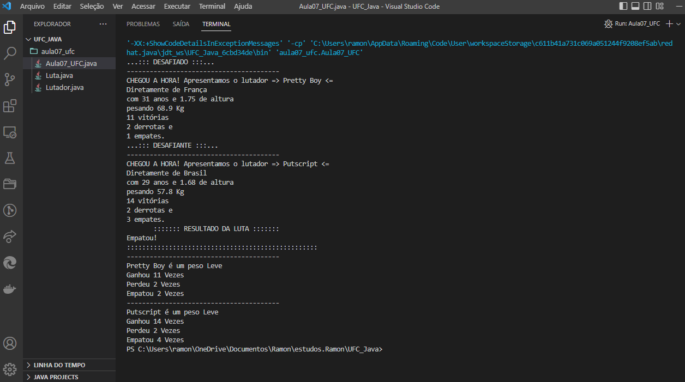
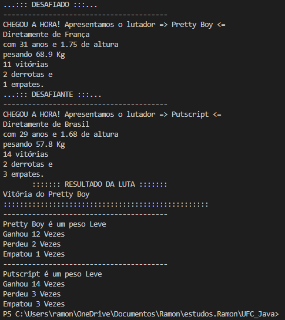
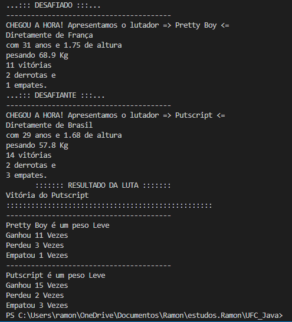

  

  

## Código - UFC - Combate 🤼‍♂️

### CursoemVídeo - Java POO ☕

Código desenvolvido como resultado das aulas 07 e 08 do Curso de Java Orientado a Objetos do Curso em Vídeo. Esse programa foi desenvolvido para simular o combate entre lutadores. Foi utilizado o comando <strong>Switch</strong> para compilar de modo aleatório o resultado das lutas.

O programa vai exibir na tela os atributos de cada lutador, o resultado da luta e apuração final com a atualização dos dados para cada participante.

- [x] Elaboração de um programa para representar combates, similar ao <strong>UFC</strong>
- [x] Cada lutador só pode lutar com um adversário de sua categoria (representada pelo peso)
- [x] O lutador tem que ter o peso mínimo para lutar e também se tem um peso máximo para lutar como requesitos
- [x] Relacionamento entre as classes <strong>Lutador</strong> e <strong>Luta</strong>
  
## Compilação 👨🏽‍💻
### Preview - Empate 🤷🏽‍♂️

  

## Preview - Vencedor 01 👨🏽

  

## Preview - Vencedor 02 👦🏽

  

## Tecnologias 🛠

- Java POO ☕

## Instrutor 👨🏽‍🏫
- <a target="_blank" href="https://www.linkedin.com/in/guanabara/">Gustavo Guanabara</a>

## Aluno 👨🏽‍🎓

- <a target="_blank" href="https://www.linkedin.com/in/ramon-barreto-076191180/">Ramon Barreto</a>

## Contato 📲

- Email: ramon_barreto_medrado@hotmail.com

